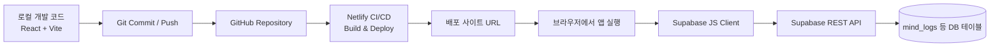

# MIND Diet App 개발자 노트 (연결 중심)

이 문서는 "이 앱을 어떻게 구축했고, 무엇과 무엇이 어떻게 연결되어 동작하는지"를 빠르게 복구하기 위한 운영/개발 메모다.

## 1) 전체 구성 한눈에 보기



핵심 요약:
- GitHub: 소스 버전관리 + 배포 트리거
- Netlify: 정적 프론트엔드 빌드/호스팅
- Supabase: 앱이 호출하는 API + DB

---

## 2) 구축 방식 (연결 관점)

### A. 프론트엔드 앱
- 스택: `React + Vite + TailwindCSS + TypeScript`
- 클라이언트에서 Supabase SDK를 직접 사용한다.

관련 파일:
- `src/lib/supabase.ts`
- `src/components/HomeView.tsx`
- `src/components/LogView.tsx`

### B. GitHub 연결
- 로컬에서 기능 개발 후 `git push`를 수행한다.
- 원격 저장소(GitHub)가 "배포 소스" 역할을 한다.

### C. Netlify 연결
- Netlify 사이트가 GitHub 저장소와 연결되어 있다.
- 특정 브랜치(보통 `main`)에 push되면 자동 빌드/배포한다.
- 이 프로젝트는 Vite이므로 일반적으로:
  - Build command: `npm run build`
  - Publish directory: `dist`

### D. Supabase 연결
- Supabase는 Netlify와 직접 결합된 DB가 아니라,
  "브라우저에서 실행되는 앱 코드"가 API로 호출하는 외부 백엔드다.
- 연결 정보는 환경변수로 주입한다.
  - `VITE_SUPABASE_URL`
  - `VITE_SUPABASE_ANON_KEY`

클라이언트 생성 코드:

```ts
// src/lib/supabase.ts
const supabaseUrl = import.meta.env.VITE_SUPABASE_URL
const supabaseAnonKey = import.meta.env.VITE_SUPABASE_ANON_KEY
export const supabase = hasValidConfig ? createClient(supabaseUrl, supabaseAnonKey) : null
```

---

## 3) 실행 시 동작 방식

## 3-1. 앱 기동
1. 사용자가 Netlify URL 접속
2. 브라우저가 JS 번들 다운로드 후 앱 실행
3. `src/lib/supabase.ts`에서 환경변수 기반 클라이언트 생성

## 3-2. 데이터 조회 (예: 홈/기록 화면)
- 화면 컴포넌트에서 Supabase `select` 호출
- Supabase REST API가 DB를 조회해 JSON 반환
- React 상태(state)에 반영되어 UI 렌더링

예시:
- `HomeView.tsx`에서 주간 로그 조회 (`select`)
- `LogView.tsx`에서 날짜/끼니별 기존 기록 조회 (`select`)

## 3-3. 데이터 저장 (예: 기록하기 버튼)
- 사용자가 항목 체크 후 저장
- `LogView.tsx`에서 기존 기록 정리 후 신규 데이터 `insert`
- 성공 시 토스트/화면 상태 갱신

---

## 4) "왜 GitHub를 거치나?"

GitHub를 쓰는 이유:
- 변경 이력 관리 (언제/무엇이 바뀌었는지 추적)
- 협업/백업
- Netlify 자동 배포 트리거 (push 기반 CI/CD)

즉, "개발은 로컬", "배포 자동화는 GitHub -> Netlify" 흐름이다.

---

## 5) 연결 확인 체크리스트

## 5-1. Netlify 쪽
- Site settings -> Build & deploy
  - Repository 연결 여부
  - Branch 설정
  - Build command / Publish directory

## 5-2. Netlify 환경변수
- Site settings -> Environment variables
  - `VITE_SUPABASE_URL`
  - `VITE_SUPABASE_ANON_KEY`

## 5-3. 브라우저에서 실제 호출 확인
- 개발자도구(F12) -> Network
- `supabase` 또는 `rest/v1` 필터
- 조회/저장 동작 시 요청 확인
  - Method: `GET/POST/DELETE`
  - Status: `200/201` 정상

---

## 6) 자주 헷갈리는 포인트

- "Supabase를 Netlify에 연결했다"의 정확한 의미:
  - 엄밀히는 Netlify가 DB에 직접 연결되는 것이 아니라,
  - Netlify가 서빙한 프론트 코드가 Supabase API를 호출한다.

- 공개 키(`anon key`)는 클라이언트에서 사용 가능하지만,
  - Supabase RLS(행 수준 보안) 정책을 반드시 올바르게 설계해야 한다.

---

## 7) 운영 권장사항

- `.env` 및 민감정보 파일은 저장소에 커밋하지 않는다.
- `README.md`에 배포/연결 절차를 짧게 링크한다.
- 장애 대응을 위해 아래를 기록해 둔다:
  - Netlify 사이트 URL
  - 연결된 GitHub repo / branch
  - Supabase project URL
  - 환경변수 세팅 위치

